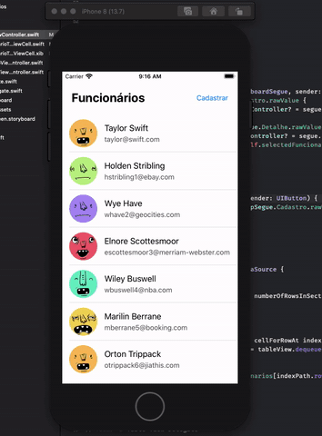

# AppFuncionarios

Desafio proposto no curso de "Desenvolvimento Mobile iOS", pela Digital House Brasil, usando os ensinamentos passados até então! 😊

Storyboard, ciclo de vida, delegates, protocols, IBOutlets e IBActions, UITableView, constraints, autolayout, xib, tipo de teclado para input além de OOD com o Swift. 🚀

